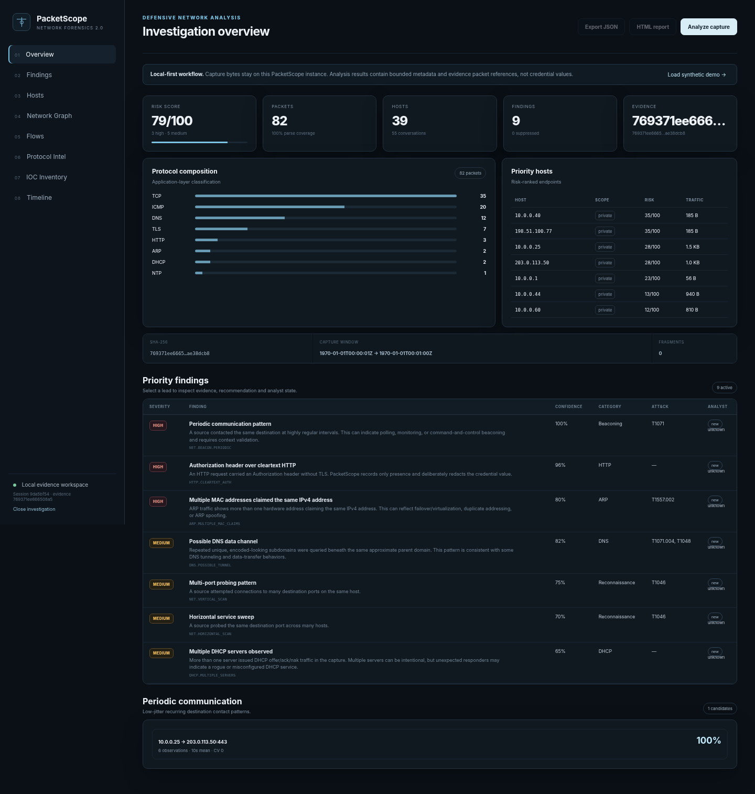
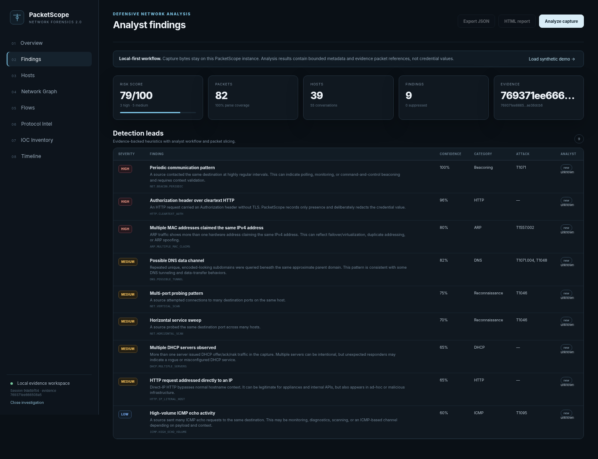
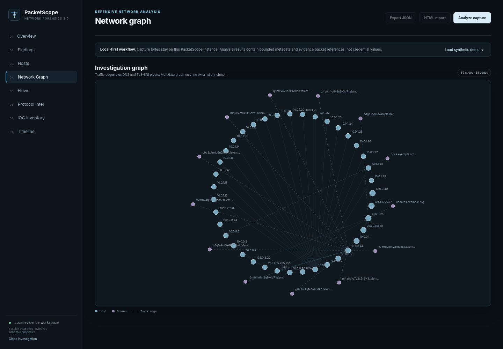
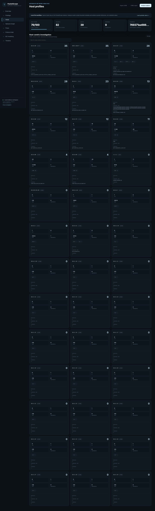
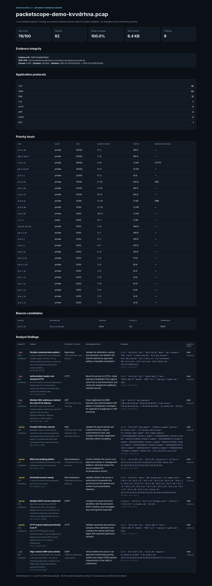
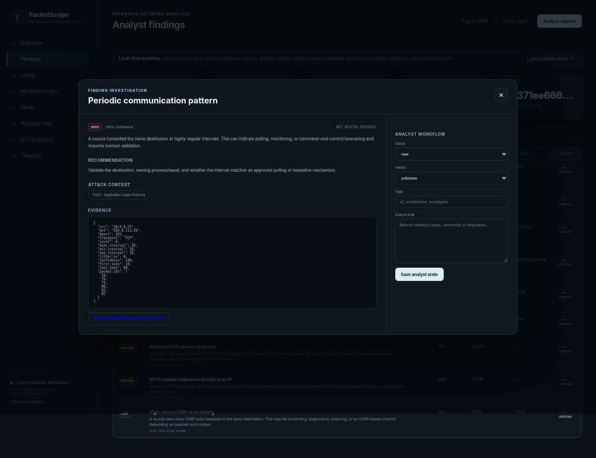
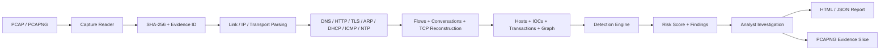
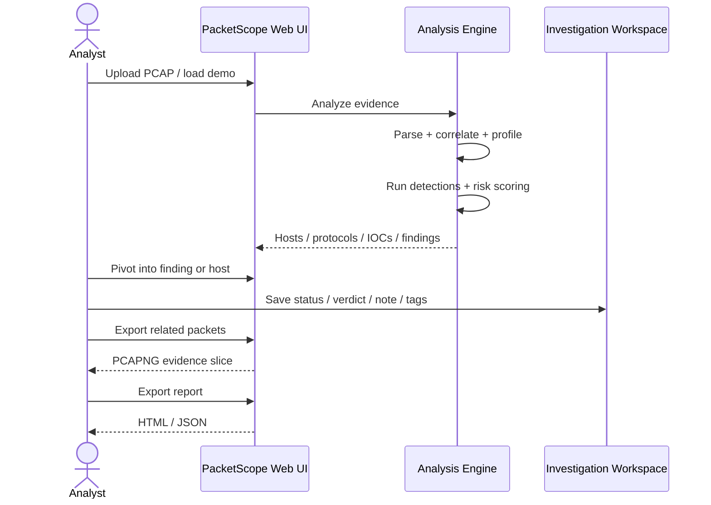

<div align="center">

# PacketScope 2.0

### Local-first Network Forensics & Packet Investigation Workbench

Turn raw **PCAP / PCAPNG** evidence into structured investigations with protocol intelligence, host profiling, behavioral detections, analyst workflow, reporting, and packet-level evidence export.

[](https://github.com/ShalvaLekishvili/PacketScope/actions)
[](https://www.python.org/)
[](https://fastapi.tiangolo.com/)
[](LICENSE)
[](tests/)
[](docs/PROTOCOL_SUPPORT.md)

[Quick Start](#quick-start) · [How It Works](#how-it-works) · [Detection Model](docs/DETECTION_MODEL.md) · [Architecture](docs/ARCHITECTURE.md) · [Security Model](docs/SECURITY_MODEL.md)

</div>

---

> [!IMPORTANT]
> **PacketScope is a defensive analysis tool.** Findings are heuristic investigative leads that require analyst and environmental validation. They are not automatic malicious verdicts.

## Product Preview

The screenshots below are generated from PacketScope's **bundled synthetic demo capture** and show the actual web application and analysis output.



<p align="center"><sub>Investigation overview — risk score, protocol composition, priority hosts, findings and evidence identity.</sub></p>

<table>
<tr>
<td width="50%">

<br/><sub><b>Detection leads</b> — evidence-backed findings with severity, confidence and ATT&CK context.</sub>
</td>
<td width="50%">

<br/><sub><b>Investigation graph</b> — host traffic with DNS and TLS/SNI pivots.</sub>
</td>
</tr>
<tr>
<td width="50%">

<br/><sub><b>Host-centric analysis</b> — traffic, services, domains, protocols and attributed findings.</sub>
</td>
<td width="50%">

<br/><sub><b>Self-contained report</b> — portable HTML output for review and evidence handoff.</sub>
</td>
</tr>
</table>

### Finding Investigation



The finding workflow links detection logic to the exact evidence packets behind the lead and supports analyst **status, verdict, notes and tags**.

---

## What PacketScope Does

PacketScope sits between raw packet inspection and a full NDR stack. It is designed for **SOC, DFIR, incident-response and network-forensics workflows** where an analyst wants structured context without sending evidence to a cloud service.

| Capability | What you get | Implementation reference |
|---|---|---|
| Capture ingestion | PCAP / PCAPNG, evidence SHA-256, link-layer handling | [`capture.py`](packetscope/capture.py) |
| Protocol decoding | DNS, HTTP, TLS, ARP, DHCP, ICMP, NTP, IPv4/IPv6 | [`protocols.py`](packetscope/protocols.py) |
| Investigation model | Hosts, flows, conversations, transactions, graph, timeline | [`analysis.py`](packetscope/analysis.py) |
| Behavioral detections | Beaconing, scan patterns, DNS anomalies, DHCP/ARP/TLS leads | [`detectors.py`](packetscope/detectors.py) |
| Suppression / tuning | Environment-aware allowlists and thresholds | [`config.py`](packetscope/config.py) |
| Analyst workspace | Session state, verdicts, notes and tags | [`workspace.py`](packetscope/workspace.py) |
| Evidence slicing | Export finding-related packets to standalone PCAPNG | [`slicing.py`](packetscope/slicing.py) |
| Reporting | JSON + self-contained HTML output | [`reporting.py`](packetscope/reporting.py) |
| API | FastAPI investigation service | [`api.py`](packetscope/api.py) |
| CLI | Analyze, report, serve and slice workflows | [`cli.py`](packetscope/cli.py) |

---

## How It Works



### Analyst workflow



For the deeper design rationale, see [`docs/ARCHITECTURE.md`](docs/ARCHITECTURE.md) and [`docs/INVESTIGATION_WORKFLOW.md`](docs/INVESTIGATION_WORKFLOW.md).

---

## Real Demo Result

The bundled demo is fully synthetic, reproducible and intentionally contains multiple network behaviors.

```bash
python scripts/generate_demo_pcap.py
packetscope analyze sample-data/demo-beacon.pcap
```

A normal demo run produces an investigation shaped roughly like this:

```text
Risk score       79 / 100
Packets          82
Hosts            39
Conversations    55
Findings         9

Observed protocol metadata
TCP · ICMP · DNS · TLS · HTTP · ARP · DHCP · NTP
```

The demo includes examples of:

- periodic TLS communication
- DNS request/response activity
- encoded-looking DNS labels
- vertical and horizontal SYN probing
- duplicate ARP IPv4 claims
- multiple DHCP responders
- ICMP echo bursts
- cleartext HTTP Authorization presence with the credential value redacted

See [`docs/DEMO.md`](docs/DEMO.md) for the scenario description.

---

## Detection Coverage

PacketScope currently provides evidence-backed heuristic leads for:

| Detection | Typical analyst question |
|---|---|
| Periodic communication / beaconing | Is a host contacting the same destination at unusually regular intervals? |
| DNS data-channel pattern | Are encoded-looking labels being repeatedly queried under the same parent domain? |
| NXDOMAIN anomaly | Is a host generating an unusual volume or pattern of failed DNS lookups? |
| Vertical scan | Is one source probing many ports on one destination? |
| Horizontal sweep | Is one source probing the same service across many destinations? |
| Cleartext HTTP authorization | Was an authorization-bearing request observed without TLS? |
| Direct-IP HTTP | Is HTTP being sent directly to an IP rather than a hostname? |
| ARP identity conflict | Are multiple MAC addresses claiming the same IPv4 address? |
| Multiple DHCP servers | Are unexpected DHCP responders present? |
| ICMP burst | Is ICMP behavior unusually concentrated? |
| TLS anomaly | Does TLS metadata expose legacy or unusual configuration? |
| Large outbound transfer | Is one conversation moving an unusually large amount of outbound data? |

Detection implementation: [`packetscope/detectors.py`](packetscope/detectors.py)  
Detection philosophy and thresholds: [`docs/DETECTION_MODEL.md`](docs/DETECTION_MODEL.md)

---

## Protocol & Evidence Support

### Link / network / transport

- Ethernet
- VLAN metadata
- Linux cooked **SLL / SLL2**
- BSD null / loopback
- Raw IPv4 / IPv6
- IPv4 / IPv6
- TCP / UDP / ICMP
- ARP

### Application metadata

- **DNS** RR parsing and transaction correlation
- **HTTP** request/response metadata with sensitive-value redaction
- **TLS** ClientHello / ServerHello, SNI, ALPN, JA3 and version metadata
- plaintext X.509 metadata when visible in the capture
- DHCP
- NTP

Full support matrix: [`docs/PROTOCOL_SUPPORT.md`](docs/PROTOCOL_SUPPORT.md)

---

## Quick Start

### Python

```bash
python -m venv .venv
source .venv/bin/activate          # Windows: .venv\Scripts\activate
python -m pip install -e ".[dev]"

packetscope serve
```

Open:

```text
http://127.0.0.1:8000
```

### Docker

```bash
docker compose up --build
```

The Compose configuration binds to localhost by default, runs the application as an unprivileged user, drops Linux capabilities and enables `no-new-privileges`.

---

## CLI

### Analyze evidence

```bash
packetscope analyze evidence.pcap
```

### Create reports

```bash
packetscope analyze evidence.pcap --report evidence.html
packetscope analyze evidence.pcap --report evidence.json
packetscope analyze evidence.pcap --json > evidence.stdout.json
```

### Apply an environment profile

```bash
packetscope analyze evidence.pcap --config config.example.json
```

### Export packet-level evidence

```bash
packetscope slice evidence.pcap finding-evidence.pcapng --packets 12,18,21,34
```

---

## API

When PacketScope is running, FastAPI exposes interactive OpenAPI documentation at:

```text
http://127.0.0.1:8000/docs
```

Core routes:

```text
GET    /api/health
GET    /api/config
POST   /api/analyze?filename=evidence.pcap
GET    /api/demo
GET    /api/sessions/{session_id}
PATCH  /api/sessions/{session_id}/findings/{finding_id}
GET    /api/sessions/{session_id}/findings/{finding_id}/slice
GET    /api/sessions/{session_id}/report
DELETE /api/sessions/{session_id}
POST   /api/report
```

API implementation: [`packetscope/api.py`](packetscope/api.py)

---

## Security & Privacy

PacketScope follows a deliberately local-first model:

- no cloud upload by default
- no active scanning or packet-capture functionality
- no automatic internet reputation lookup
- uploaded evidence stays in the configured local workspace
- random investigation session IDs
- session TTL cleanup + explicit deletion
- bounded collections and stream reconstruction
- default web upload limit of **100 MB**
- Authorization/Cookie values are not included in analysis output
- HTML report strings derived from captures are escaped
- evidence slices preserve original selected packet bytes

Read the complete model in [`SECURITY.md`](SECURITY.md) and [`docs/SECURITY_MODEL.md`](docs/SECURITY_MODEL.md).

---

## Testing & Release Validation

```bash
pytest -q
# 48 tests
```

The test suite covers capture parsing, malformed/truncated input, link-layer handling, protocol parsing, DNS safety, TLS/DHCP/NTP metadata, detections, suppressions, reporting, API sessions, analyst annotations and packet slicing.

CI configuration: [`.github/workflows/ci.yml`](.github/workflows/ci.yml)  
Release validation: [`docs/RELEASE_VALIDATION.md`](docs/RELEASE_VALIDATION.md)  
Tests: [`tests/`](tests/)

---

## Repository Structure

```text
PacketScope/
├── packetscope/
│   ├── analysis.py       # orchestration, correlations, hosts and graph
│   ├── capture.py        # PCAP/PCAPNG readers + PCAPNG writer
│   ├── protocols.py      # bounded protocol decoders
│   ├── detectors.py      # behavioral detections and risk scoring
│   ├── config.py         # thresholds, allowlists and suppression
│   ├── slicing.py        # packet-level evidence export
│   ├── workspace.py      # local sessions + analyst annotations
│   ├── reporting.py      # JSON / HTML reporting
│   ├── api.py            # FastAPI service
│   ├── cli.py            # CLI entry point
│   └── web/              # packaged investigation UI
├── sample-data/          # synthetic capture
├── scripts/              # demo generation
├── tests/                # automated test suite
├── docs/                 # architecture, security and workflow docs
├── Dockerfile
├── docker-compose.yml
└── pyproject.toml
```

---

## Known Boundaries

PacketScope intentionally does **not** claim to replace Wireshark, Zeek, Suricata or a production NDR platform.

- IP fragments are identified but not reassembled.
- TCP reconstruction is bounded and stops at missing sequence gaps.
- Encrypted application payloads are not decrypted.
- TLS 1.3 normally hides post-ServerHello certificate messages without key material.
- DNS parent-domain grouping is approximate and does not bundle a public-suffix database.
- Heuristics can produce false positives and require analyst validation.

This boundary is intentional: PacketScope favors **transparent evidence-backed analysis** over pretending to know more than the capture reveals.

---

## Documentation

| Document | Purpose |
|---|---|
| [`ARCHITECTURE.md`](docs/ARCHITECTURE.md) | Internal processing pipeline and components |
| [`DETECTION_MODEL.md`](docs/DETECTION_MODEL.md) | Detection behavior, scoring and assumptions |
| [`INVESTIGATION_WORKFLOW.md`](docs/INVESTIGATION_WORKFLOW.md) | Analyst investigation flow |
| [`PROTOCOL_SUPPORT.md`](docs/PROTOCOL_SUPPORT.md) | Supported protocol and link-layer coverage |
| [`SECURITY_MODEL.md`](docs/SECURITY_MODEL.md) | Trust boundaries and privacy controls |
| [`RELEASE_VALIDATION.md`](docs/RELEASE_VALIDATION.md) | Release and smoke-test gates |
| [`DEMO.md`](docs/DEMO.md) | Synthetic demonstration scenario |

---

## Responsible Use

Use PacketScope only on packet captures you are authorized to inspect. Network captures can contain credentials, tokens, personal information and proprietary data even when selected sensitive fields are redacted in PacketScope output.

---

<div align="center">

**Built for transparent, local-first network investigation.**

If PacketScope is useful to you, consider starring the repository or opening an issue with reproducible feedback.

[Report an issue](https://github.com/ShalvaLekishvili/PacketScope/issues) · [Security policy](SECURITY.md) · [Contributing](CONTRIBUTING.md)

MIT License · [`LICENSE`](LICENSE)

</div>
